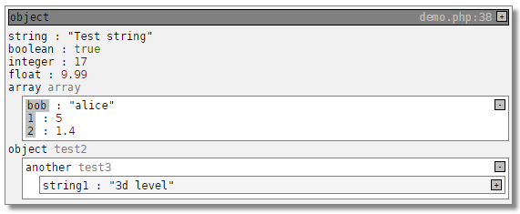
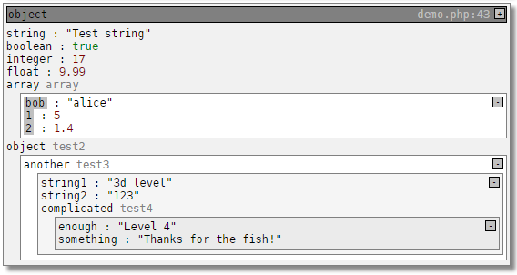

function debug ($object)
================

function debug (mixed $object, string/boolean $title=null, boolean/string $plain=false, integer $limit=6)

**debug** is a single function for visually analything / logging complex deep level objects and arrays.

Example of debug call html output:


Let us have an example classes (check ./demo/demo.php)
```php
	class test1
	{
		public $string = "Test string";
		public $boolean = true;
		public $integer = 17;
		public $float = 9.99;
		public $array = array ('bob'=>'alice',true=>false,1=>5,2=>1.4);
		public $object;
	}

	class test2
	{
		public $another;
	}

	class test3
	{
		public $string1 = "3d level";
		public $string2 = "123";
		public $complicated;
	}

	class test4
	{
		public $enough = "Level 4";
		public $something = "Thanks for the fish!";
	}
```

And intialize them in a following manner:
```php
	$test = new test1 ();
	$test->object = new test2();
	$test->object->another = new test3 ();
	$test->object->another->complicated = new test4 ();
```

Now let us start debugging **$test1**. A simpliest call:
```php
	debug ($test);
```
Will output following:



Note that object of class *test3* is collapsed and only first property is visible you can unfold it by clicking + or you can just debug object with everything expanded by calling:

```php
	debug ($test, true);
```
So now we see hidden parts of our object by default



Putting title on debug:
```php
	$pi = 3.14159265359;
	debug ($pi, "hello this is pi");
```


